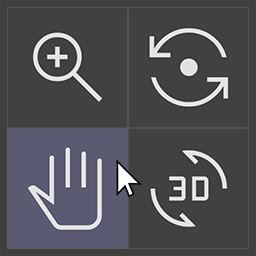

# Navigation Puck Addon

Adds a custom navigation puck widget to Blender's 3D View, allowing for enhanced navigation controls.

By default it is bind to "V" shortcut, but can be changed in addon preferences

---

Inspired by the navigation puck from Sketchbook Pro
